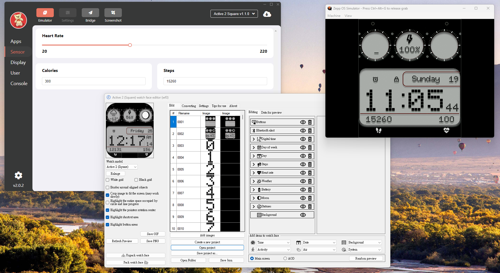
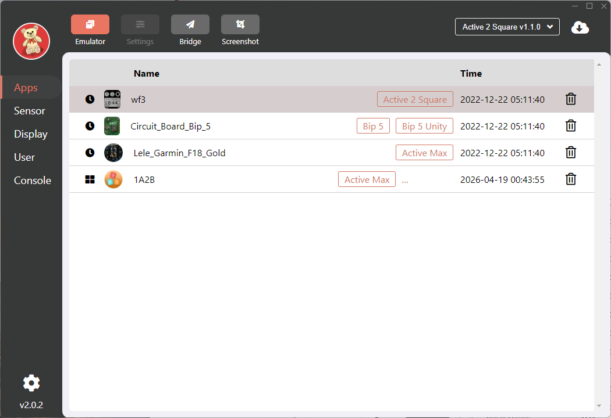
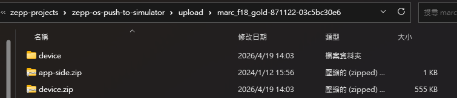
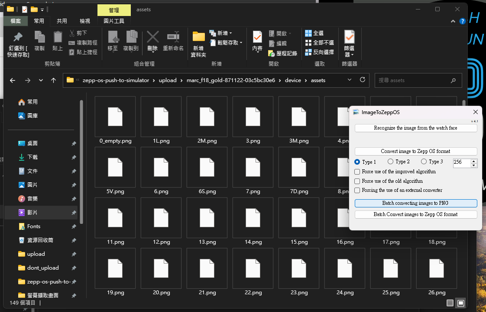
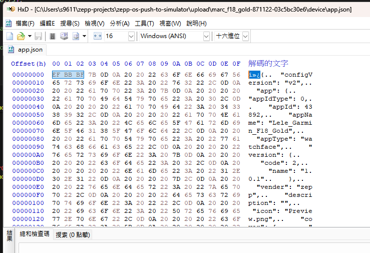
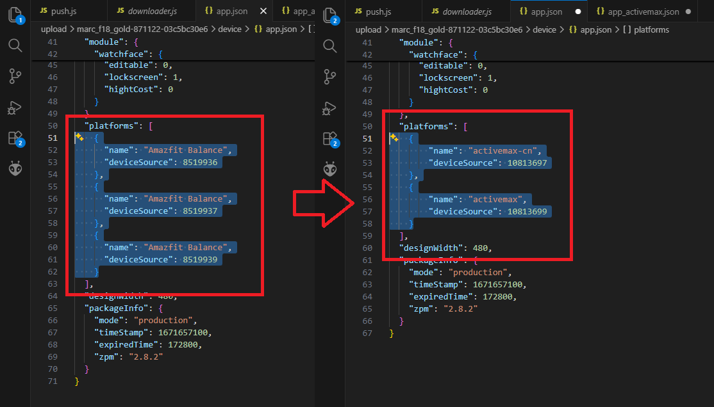
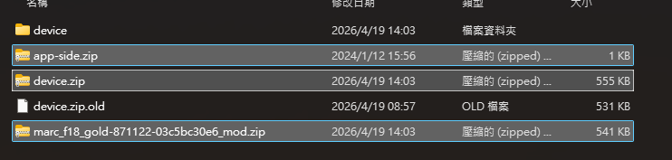
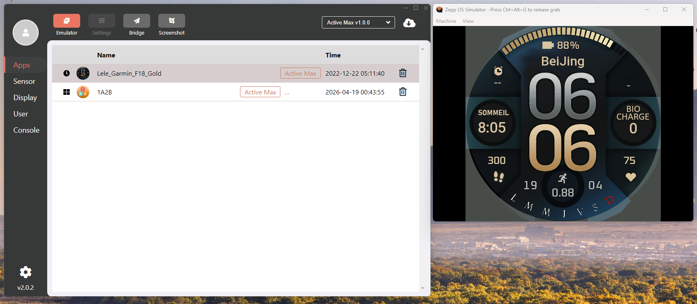

# zepp-os-push-to-simulator
Upload the zpk watchface/apps to the simulator by directly calling the function in the development CLI.

It is a way to test the watchface if you do not have a watch and want to use the powerful watchface edit tools like [SashaCX75's editor](https://amazfitwatchfaces.com/forum/memberlist.php?mode=viewprofile&u=113690)!





## How to use that?

1. Make sure the `@zeppos/zeus-cli` is installed, you can install by [this official guide](https://docs.zepp.com/docs/guides/quick-start/environment/).
2. Open the terminal, switch to the root folder of this repo, and link to the library by the command below:
   ```
   npm link @zeppos/zeus-cli
   ```
3. Create the `upload` folder at the same location, put the zpks you want to upload.
4. Extract the zpk, and the device.zip in the extracted zpk
   
5. Download the image converter made by [SashaCX75](https://amazfitwatchfaces.com/forum/memberlist.php?mode=viewprofile&u=113690) ( [Dropbox](https://www.dropbox.com/s/ugmfqg0xdv8qbcd/ImageToZeppOS.zip?dl=0) )  
   Use `Batch converting images to PNG` tool to convert back all of the images to PNG.
   > :warning: **Don't forget to check the converted file! Make sure the output PNG file can open by the image viewer correctly.**

   
6. Check your app.json file using the HEX editor tools like [HXD](https://mh-nexus.de/en/hxd/). Make sure there are no 3 extra bytes at the start of the JSON file. If it is, just delete it (Or it will cause an error when the simulator parses the JSON file.)
   
   > :warning: **If you are ready to test most of the watchfaces from the amazfitwatchfaces.com, the JSON file will have these 3 extra bytes at the file start.**
7. Open the `app.json` by the text editor, make sure the device source is correct (You can find it out at [official developer site](https://docs.zepp.com/docs/reference/related-resources/device-list/))
   
8. Repack all the content in the device folder back to the `device.zip`, and pack `device.zip` and `app-side.zip` back to the zip file. No need to rename it back to the `.zpk` extension.
   
9. Open the simulator program, launch the device's simulator you want.
10. Run the js script using this command:
    ```
    node ./push.js ./upload/<unzipped folder>/<repacked_zip>.zip ./upload/<unzipped folder>/device/app.json
    ```
    The output like this
    ```
    [ℹ] connecting to simulator on http://127.0.0.1:7650 ...
    =========================================
    🚀 Preparing to push to the simulator
    📦 Project: Lele_Garmin_F18_Gold
    🆔 AppID: 43892
    📱 Device: genevaw (Source: 10813697)
    =========================================
    ✅ Upload successful! Please check the simulator.
    [✔] simulator connected
    ```
11. You should see the app is in the simulator app's list, and the simulated device opens the app automatically.  
    (Example watchface: [Marc F18 Golf FR V1](https://amazfitwatchfaces.com/active/view/1737) made by [markillers](https://amazfitwatchfaces.com/ucp/871122))
    
9. You can now testing the function of your app/watchface !

## Developer QR File download tool: downloader.js

*  **Need to link the CLI first!, Looks the `How to use that?` part**
*  Usage: 
   ```
   node.exe .\downloader.js "zpkd1://<URL scanned by the QR>"
   ```
*  This script can download the file by URL that got from developer QR code, it will auto convert the `zpkd1` to the `https`, and try to get the file like your Zepp App.
*  If you need to get the file be hosted on the Zepp's server (Use `zeus preview`), you need fill the Real Token to this line, follows the instruction on the `fakeToken` line:
   ```js
   // You can put your real token here (Use Zepp's developer tool scan the QR code by the post url generated by
   // https://posttestserver.dev/ and replace the "https" to "zpkd1", like zpkd1://posttestserver.dev/p/<roomcode>/post)
   // fakeToken = "";  << Here
   ```
   And uncomment the `faketoken = ""` line that filled the Real Token.
*  The QR version and the direct download version watchface hosted at [amazfitwatchface.com](https://amazfitwatchfaces.com/) are different. The QR version has the `app-side.zip` in the packed zip file, and the structure is followed the zpk's, that easier to push into the simulator ~~(Or you need to pack a copy of the app.json into the app-side.zip to make the watchface work on the simulator)~~
   > :information_source: **You can upload your watchface as the private watchface, and wait amazfitwatchface.com generates the QR Code, and you can download the zpk format by this QR code download method and pushes to the simulator to see the preview!**

## Helper script: push_qr.js

*  This script need extra modules, install it by:
   ```
   npm install jimp jsqr adm-zip
   ```
   And re-link the CLI:
   ```
   npm link @zeppos/zeus-cli
   ```
*  Make sure you already creates the `upload` folder at the root folder of the repo
*  Usage: 
   ```
   node .\push_qr.js <Your QR Code Image Location>
   ```
*  It will downloads the zip package uses downloader.js, and  
   **When the Notepad opens up, you need add the device source and converts image by yourself(see the `How to use that?` part)**  
   (You can changes the editor by editing the `push_qr.js`)
*  When closes the notepad(editor), the process will continue and pushes the modified watchface into the simulator!
*  Example output:
   ```
   > node .\push_qr.js '.\upload\getqr (2).png'
   🔍 Reading QR Code: .\upload\getqr (2).png
   🔗 Got URL: https://amazfitwatchfaces.com/dl/active/zip/2081/casio_dw6000_v2-684532-522247ccb5.zip?zpk=ef150f7383&comp=Active_2_Square
   Token preview: sWCoABsPN0-J065Y_9wy2f4oc7dmEm...
   Ready to download: https://amazfitwatchfaces.com/dl/active/zip/2081/casio_dw6000_v2-684532-522247ccb5.zip?zpk=ef150f7383&comp=Active_2_Square
   ✅ File fully written to: C:\Users\s9611\zepp-projects\zepp-os-push-to-simulator\upload\casio_dw6000_v2-684532-522247ccb5.zip
   📦 Extracted to: C:\Users\s9611\zepp-projects\zepp-os-push-to-simulator\upload\casio_dw6000_v2-684532-522247ccb5
   🧹 Clean the app.json...
   📝 Please editing the device source and converts the image, process will continue when close the notepad...
   🏗️ Repacking...
   🚀 Pushing to simulator...
   [ℹ] connecting to simulator on http://127.0.0.1:7650 ...
   =========================================
   🚀 Preparing to push to the simulator
   📦 Project: Casio DW6000_v2
   🆔 AppID: 3873975
   📱 Device: undefined (Source: 9830656)
   =========================================
   ✅ Upload successful! Please check the simulator.
   [✔] simulator connected
   ```
